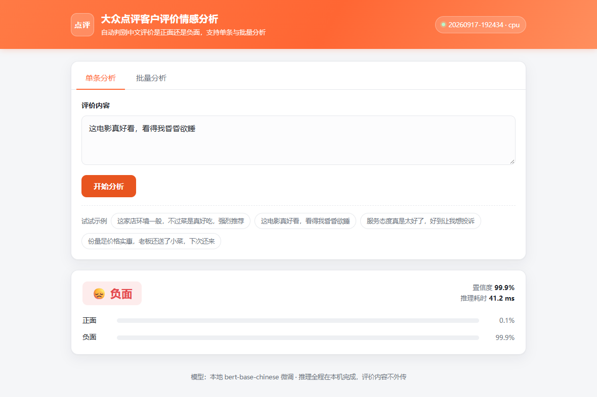
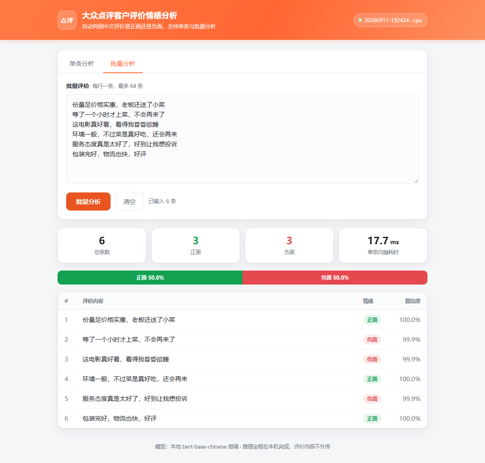

# 大众点评客户评价情感分析

中文用户评价的正负面自动判别：在 `bert-base-chinese` 上微调，对外提供 REST API 和 Web 页面。
模型和推理都在本机 CPU 上，评价内容不出机器。

## 背景

点评、电商平台的用户评价量大，逐条人工看成本高。这个项目做一个能直接跑起来的本地情感判别：

- **数据自己造** —— 训练语料由模板合成（正负各 200 条），不依赖外部数据集，克隆下来就能跑通全流程。
- **模型自己训** —— 在本地 `bert-base-chinese` 上微调，一次约 2 分半（CPU）。
- **推理不出网** —— 服务加载本地模型，请求内容不外传。

效果（`data/test_sentences.json`，22 条人工标注，含否定、口语、反讽、转折句式）：

| 指标 | 值 |
|---|---|
| 准确率 | 21/22（95.5%） |
| F1 | 0.95 |
| 单条推理延迟 | 32–43 ms（CPU） |
| 批量单条均摊 | 18–26 ms |

> 验证集准确率是 100%，但**这个数字没有意义**——训练集和验证集同分布。
> 上面 22 条是人工写的、故意混了容易踩坑的句式，才是有参考价值的那个数。

## 架构

### 目录结构

标注：`[代码]` 入库源码 · `[配置]` 入库配置 · `[产物]` 运行时生成、已 gitignore · `[需自备]` 需自行下载

```
bert-finetune/
├── scripts/cli.py              [代码] 唯一命令行入口，四个子命令
├── config.yaml                 [配置] 唯一配置真源，训练和服务共用这一份
├── src/dianping_sentiment/     [代码] 业务代码，见下表
├── tests/test_all.py           [代码] 19 个冒烟测试，不依赖 pytest
│
├── data/
│   ├── test_sentences.json            22 条人工标注测试集，评估用
│   └── processed/                     [产物] 合成训练数据，generate 生成，可删可重建
├── bert-base-chinese/          [需自备] 预训练权重，约 400MB，见「部署运行」
├── models/<时间戳>/             [产物] 训练产出的模型，服务默认加载最新一个
└── runs/<时间戳>/               [产物] 每次训练的存档：配置/指标/日志/曲线，约 100KB
```

### 模块职责

```
src/dianping_sentiment/
├── config.py      读 config.yaml → 带类型校验的 dataclass；serving 段支持 DS_* 环境变量覆盖
├── data.py        模板合成训练数据（含转折、反讽句式）+ 包成 PyTorch Dataset
├── model.py       唯一的推理实现：加载权重、批量推理、SentimentPredictor（模型常驻内存）
├── train.py       训练主流程 + run 存档（manifest / 指标 / 控制台日志 / 曲线）
├── evaluate.py    测试集评估：准确率 / F1 / 混淆矩阵 / 错例
├── service.py     Flask 应用工厂 + 路由 + 请求校验 + 请求日志
├── templates/     页面骨架
└── static/        原生 JS + CSS，无构建步骤，改完刷新即可
```

### 一次请求的路径

```
POST /api/predict
  └─ _extract_single()            校验参数，不合法直接 400
  └─ SentimentPredictor.predict() 模型常驻内存，请求路径上没有磁盘 IO
       └─ run_inference()         按长度排序 → 动态 padding → 前向 → softmax → 还原顺序
  └─ _single_response()           组织成 {prediction, latency_ms}
```

模型在服务启动时加载一次并预热，所以第一个请求不会慢几倍。

### 三个关键设计

- **只有一份推理实现**（`model.py`）。离线评估、训练后抽查、线上服务走同一条代码路径，
  不会出现「评估挺好、上线不对」。
- **一份配置、一处真源**。训练参数和服务参数在同一个 `config.yaml` 的不同段里，
  服务段支持环境变量覆盖，容器里换个 `DS_MODEL_DIR` 就能切模型，不用重建镜像。
- **一次训练 = 一个 run**。`runs/<时间戳>/` 存配置/指标/日志/曲线的完整快照，
  历史 run 不会被覆盖；模型单独落到 `models/<时间戳>/`。

性能上，推理路径做过动态 padding、`inference_mode`、批量内按长度排序等优化，
单条从 120 ms 降到 32–43 ms，**不涉及模型结构、量化或精度取舍**。
`tests/test_all.py` 里有用例逐条比对优化前后的输出，保证提速没改变预测结果。

## 部署运行

### 1. 准备预训练模型（必做）

仓库**不含任何权重**（体积大，已在 `.gitignore` 排除），需要自己准备：

```bash
# 只取 PyTorch 用得到的 5 个文件（411.9M）。整个仓库含 4 种框架格式共 1.6G，
# 不指定文件名就会全下——tf/flax/bin 那三份是同一份权重的不同容器，白占 1.3G。
uv run hf download google-bert/bert-base-chinese --local-dir bert-base-chinese \
  config.json model.safetensors vocab.txt tokenizer.json tokenizer_config.json
```

放到项目根目录 `bert-base-chinese/`。缺这个目录会直接报错，不会静默联网补。
（国内网络下不动 HF 的话，改用 ModelScope 下同名模型，目录放到同样位置即可。）

### 2. 跑起来

```bash
uv sync                                          # 装依赖

uv run python scripts/cli.py generate            # 生成训练数据（模板合成，正负各 200 条）
uv run python scripts/cli.py train               # 训练；在 runs/ 存档、在 models/ 产出模型
uv run python scripts/cli.py evaluate            # 用测试集评估最新模型
uv run python scripts/cli.py serve               # 启动服务 → http://127.0.0.1:8000
```

`--help` 看全部用法，`--config` 可指定非默认配置文件。

### 3. 页面效果

单条分析（示例特意用了一句反讽，模型判为负面）：



批量分析（每行一条，输出正负占比汇总 + 逐条结果）：



### 4. 配置

一份 `config.yaml`，五段：

| 段 | 内容 | 谁用 |
|---|---|---|
| `data` | 数据路径、每类样本数、验证集比例、随机种子 | 生成数据 / 训练 / 评估 |
| `model` | 预训练权重路径、类别数、截断长度 | 训练 / 推理 |
| `train` | batch size、epochs、学习率、日志步长 | 训练 |
| `run` | `runs/` 和 `models/` 输出目录 | 训练 |
| `serving` | 端口、线程数、模型目录、批量上限、日志级别 | 服务 |

服务段每一项都能用**环境变量覆盖**，容器部署不用重建镜像：

```bash
DS_HOST=0.0.0.0 DS_PORT=8000 \
DS_MODEL_DIR=models/20260917-192434 \
DS_NUM_THREADS=4 DS_LOG_LEVEL=WARNING \
uv run python scripts/cli.py serve
```

`serving.model_dir` 留空时自动取 `models/` 下最新的一个（本地开发省事）；
**上线时应写死某个时间戳目录**，避免多训了一版模型被悄悄切走。

### 5. Docker

```bash
docker build -t dianping-sentiment .
docker run --rm -p 8000:8000 -v "$PWD/models:/app/models:ro" dianping-sentiment
```

模型不进镜像（400MB 且随训练变化），运行时挂载。要固定版本就加
`-e DS_MODEL_DIR=/app/models/<时间戳>`。容器内用 waitress 跑 WSGI，配了 `/api/health` 健康检查。

### 6. 接口

页面提供单条分析和批量分析（一行一条）。接口同样对外可用：

| 方法 | 路径 | 说明 |
|---|---|---|
| GET | `/api/health` | 存活探针，不碰模型 |
| GET | `/api/meta` | 当前生效的模型 / 设备 / 线程数 |
| POST | `/api/predict` | 单条：`{"text": "..."}` |
| POST | `/api/predict_batch` | 批量：`{"texts": ["...", ...]}`，也接受换行分隔的字符串 |

```bash
curl -X POST http://127.0.0.1:8000/api/predict \
  -H "Content-Type: application/json" \
  -d '{"text": "这电影真好看，看得我昏昏欲睡"}'
# {"text": "...", "latency_ms": 43.5,
#  "prediction": {"label": "负面", "label_id": 0, "confidence": 0.9994,
#                 "probs": {"负面": 0.9994, "正面": 0.0006}}}
```

参数不合法一律返回 400 + `{"error": "..."}`；批量上限由 `serving.max_batch_size` 控制（默认 64）。
`latency_ms` 是整批耗时，`per_item_ms` 才是分摊后的单条成本。

## 测试

```bash
uv run python tests/test_all.py
```

19 个用例，不依赖 pytest，直接跑。覆盖数据生成、配置加载与环境变量覆盖、
接口校验与响应结构（用假模型，不加载权重）、以及推理正确性。
需要真实模型的用例在 `models/` 为空时会自动跳过。

## 已知边界

- **训练数据是合成的**，句式单一，验证集高分不代表真实场景泛化。
  想要更真实的效果，应接入真实语料（大众点评/美团/微博的真实评论）。
- **没有 checkpoint**。单次训练只要 2 分半，重跑一遍比留断点便宜；代价是不能断点续训，
  且保存的是最后一轮而非 val 最优轮（实测这里是同一轮）。
- **并发**：推理是 CPU 密集型，多线程并发实际是排队。要提高吞吐应该横向扩副本，而不是加线程数。
- **未覆盖**：没有模型注册表 / 灰度发布 / 监控指标（Prometheus 等）。
